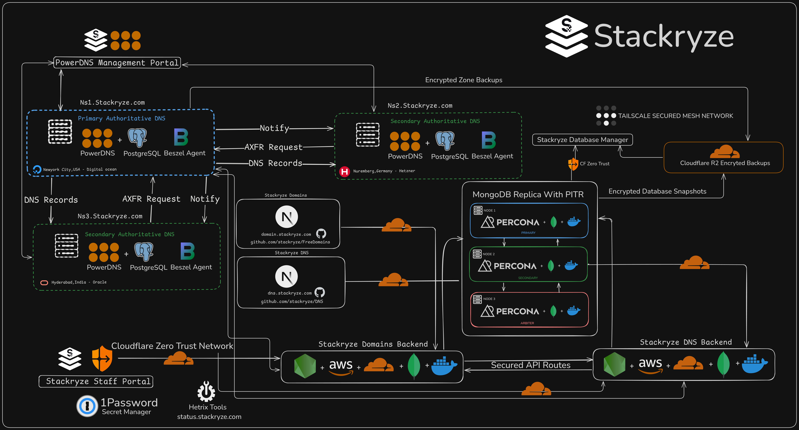

# 🌐 Claim Free Domains — Powered by Stackryze Domains

**Join our Discord:** https://discord.gg/wr7s97cfM7

---

**Stackryze Domains** runs **Multiple** Domains Names, a free managed subdomain service for developers, students, and open-source communities.

Claim a domain and point it to any hosting provider or your own infrastructure. You get full ownership and complete control.

**Build fast. Deploy freely. No lock-in.**

---

## Why US?

Our goal is simple: remove cost and complexity from getting online.

- Free managed domains  
- Works with any hosting or DNS provider  
- Built for students, developers, and OSS projects  
- Transparent, community-driven, and reliable  

---

## 🌍 Available Domains

- **.indevs.in**
- **.sryze.cc**
- **.ryzedns.org**
- **.nx.kg**
*More extensions coming soon.*

---
## 🏗️ Architecture
We believe transparency should be demonstrated, not advertised. That's why we're publicly sharing the infrastructure and systems behind Stackryze Domains and Stackryze DNS, and we're fully open to feedback, questions, and scrutiny from the community.

## 🌐 DNS Infrastructure

Stackryze Domains Namespaces are backed by globally distributed name servers for reliability and low latency:

- **ns1.stackryze.com** — Primary DNS server (New York City, USA)
- **ns2.stackryze.com** — Secondary DNS Server (Nuremberg, Germany)  
- **ns3.stackryze.com** — Secondary DNS server (Hyderabad, India)

---
## ❤️ Sponsors

Supported by organizations that believe in open-source and developer communities.

&nbsp;&nbsp;&nbsp;

&nbsp;&nbsp;&nbsp;

&nbsp;&nbsp;&nbsp;

---

## 🚀 Get Started

**Dashboard:** https://domain.stackryze.com   
**GitHub:** https://github.com/stackryze/FreeDomains/issues  
**Discord:** https://discord.gg/wr7s97cfM7   
**Support:** support@stackryze.com  
## Service Status

Live status and incident updates for all Stackryze services: https://status.stackryze.com

---

📧 **Abuse reports:** reportabuse@stackryze.com

---

 

<strong>Stackryze Domains — a project by Stackryze.</strong>

